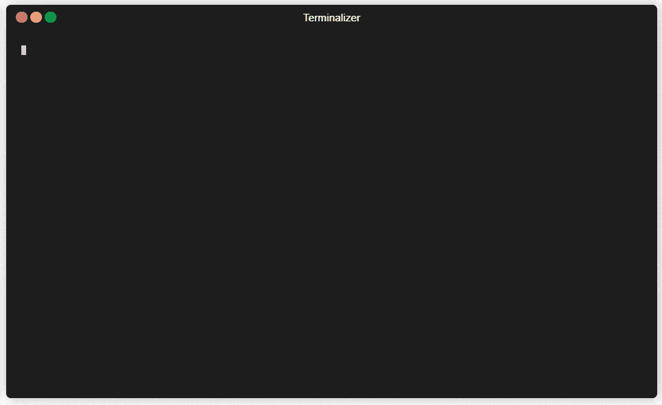

<h1 align="center">welcome to fastify-typescript-generator 👋</h1>
<p>
  
  <a href="https://www.npmjs.com/package/fastify-typescript-generator" target="_blank">
    
  </a>
  
  
  <a href="https://github.com/open-devs/fastify-typescript-generator#readme" target="_blank">
    
  </a>
  <a href="https://github.com/open-devs/fastify-typescript-generator/graphs/commit-activity" target="_blank">
    
  </a>
  <a href="https://github.com/open-devs/fastify-typescript-generator/blob/master/LICENSE" target="_blank">
  
  
  </a>
</p>

> generates new [fastify](https://www.fastify.io/) applications in everyone's favourite language [typescript](https://github.com/microsoft/TypeScript) with various options to choose from based on your project needs

### 🏠 [homepage](https://github.com/open-devs/fastify-typescript-generator#readme)

### 📰 [npm](https://www.npmjs.com/package/fastify-typescript-generator)

## 📸 demo



## install

```sh
$ npm i -g fastify-typescript-generator
```

## usage

Run anyone of following commands:

```sh
$ fastify-gen
# or
$ fastify-typescript-generator
# or
$ fastify-ts-gen
```

Or, to avoid installation and usage simply use the following command:

```sh
$ npx fastify-typescript-generator
```

## ❓ what is it

creates a new fastify application as a starter boilerplate similar to the fastify-cli module. except this new application is configured to use typeScript instead of plain javascript and provides various options such as, kind of project structure to use with focus on plugin structure for fastify developers and express structure for developers with experience in developing with express, it also provides options for typeorm or mongoose.

## 🤔 why fastify-typescript-generator

nodejs is great for the rapid development of web-projects, but is often neglected because of the lack of type safety. typescript solves this issue and (along with its linter file) can even make your code more robust than some other static languages like java.

there are some other tools out there to generate fastify apps with javascript such as fastify-cli, but these either haven't been updated in a while or don't support typescript or don't support various development patterns.

in this application you have two options to setup a project in fastify plugin architecture or express architecture, we have setup mongoose/typeorm integration, routes, swagger (in plugin structure only) for you.

## 📜 different options available explained

<table>
<caption>description of various options available</caption>
<thead>
<tr>
<th>name</th>
<th>description</th>
</tr>
</thead>
<tbody>
<tr>
<td>plugin-structure-mongoose</td>
<td>this type of structure includes fastify plugin structure which relies on modules described as reusable plugins that contain their own entities, routes & schemas, additionally paired with swagger and mongoose for connection with mongodb</td>
</tr>
<tr>
<td>plugin-structure-typeorm</td>
<td>this type of structure includes fastify plugin structure which relies on modules described as reusable plugins that contain their own entities, routes & schemas, additionally paired with swagger and typeorm for connection with various sql (like postgresql, mysql) and no-sql databases (like mongodb)</td>
</tr>
<tr>
<td>express-structure-mongoose</td>
<td>this type of structure includes express generator structure which relies on models, routes, dao, services, additionally paired with swagger and mongoose for connection with mongodb</td>
</tr>
<tr>
<td>express-structure-typeorm</td>
<td>this type of structure includes express generator structure which relies on models, routes, services, additionally paired with swagger and typeorm for connection with various sql (like postgresql, mysql) and no-sql databases (like mongodb)</td>
</tr>
</tbody>
</table>
<br>

happy app-deving 😊

## 👤 author

 **open devs (open.devs.github@gmail.com)**

* website: https://opendevs.in/
* github: [@open-devs](https://github.com/open-devs)
* core members: [@alok722](https://github.com/alok722), [@mikr13](https://github.com/mikr13)

## 🚀 future scope

* adding docker & container configurations
* adding template support
* more template structures

## 🤝 contributing

contributions, issues and feature requests are welcome!<br />feel free to check [issues page](https://github.com/open-devs/fastify-typescript-generator/issues). you can also take a look at the [contributing guide](https://github.com/open-devs/fastify-typescript-generator/blob/master/CONTRIBUTING.md).

## 🙌 show your support

give a ⭐️ if this project helped you!

<a href="https://www.buymeacoffee.com/opendevs" target="_blank"></a>

## 📝 license

copyright © 2020 [open devs (open.devs.github@gmail.com)](https://github.com/open-devs).<br />
This project is [MIT](https://github.com/open-devs/fastify-typescript-generator/blob/master/LICENSE) licensed.

***
_this README was generated with ❤️ by [readme-md-generator](https://github.com/kefranabg/readme-md-generator)_